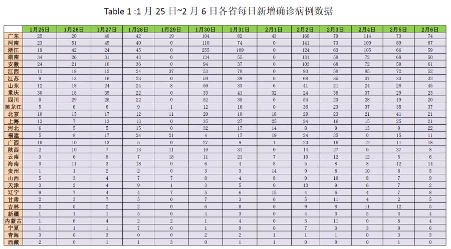
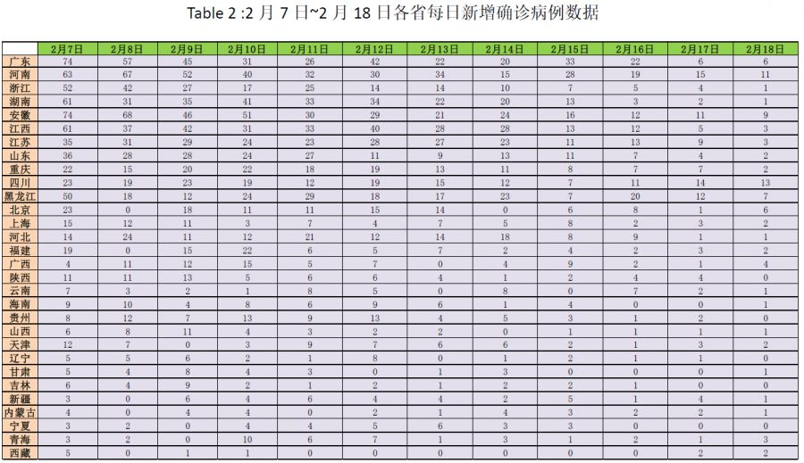
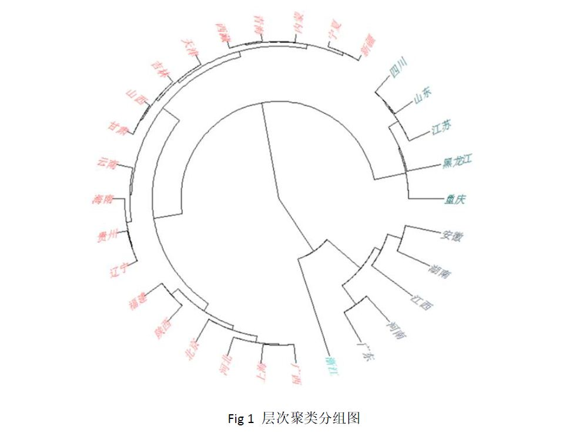
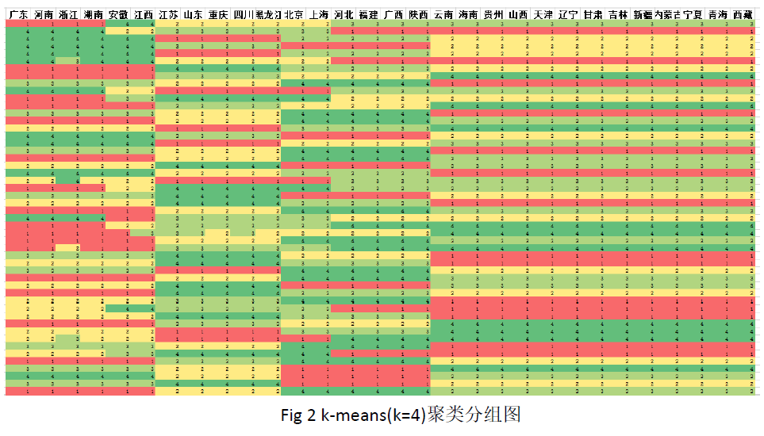
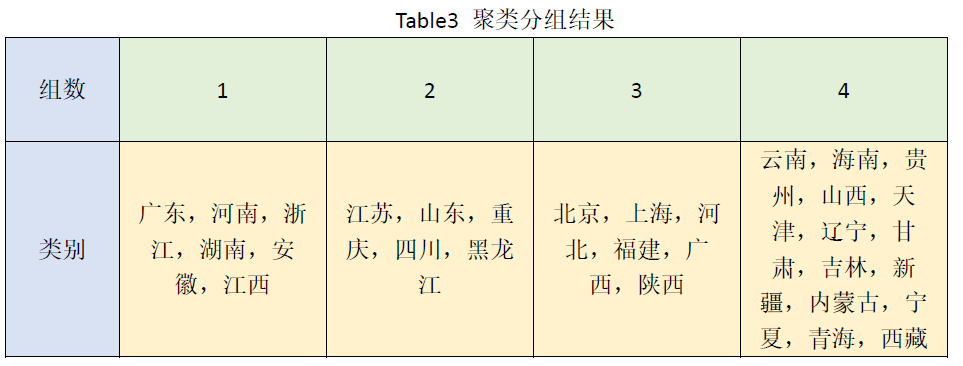
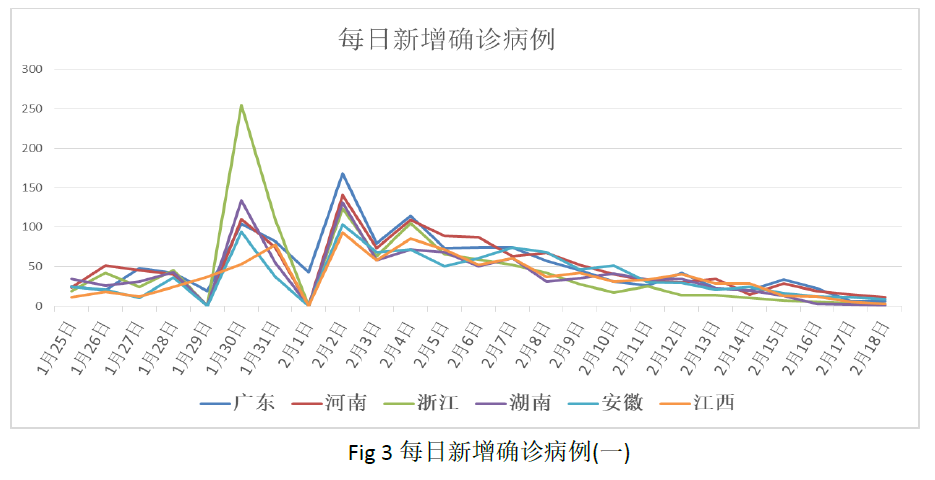
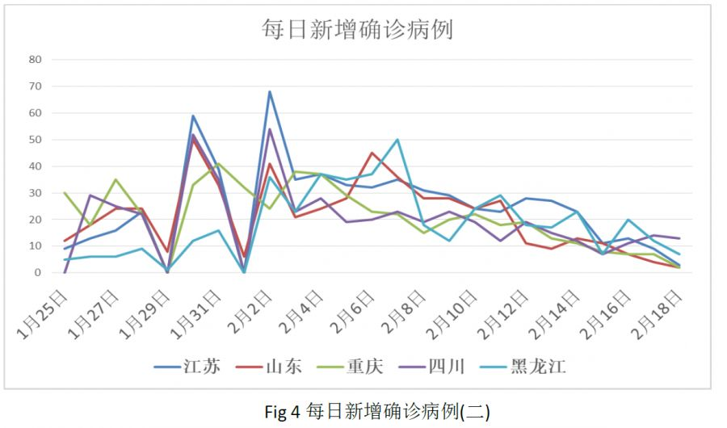
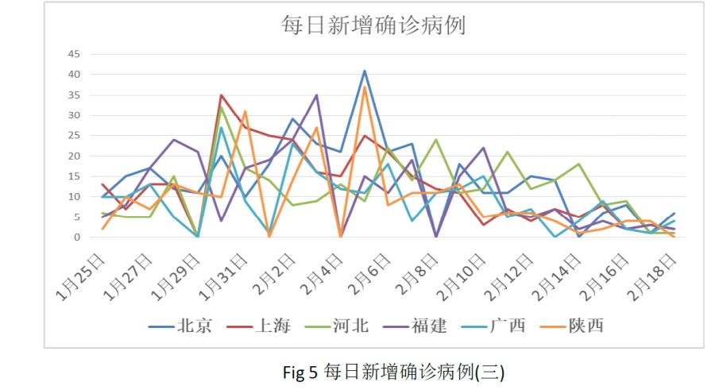
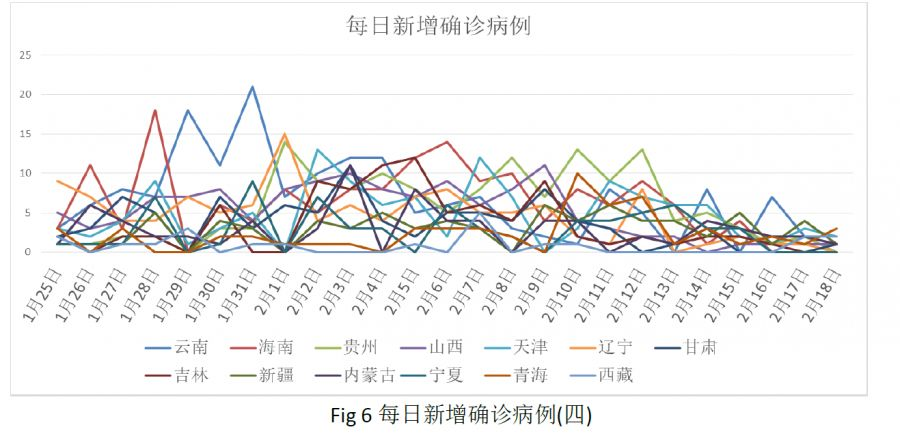

# 聚类分析及复工复产的建议

## 1数据说明
各省数据来自于新浪网站每天早上10点公布的数据，由于统计的时间不同，因此会与各省卫健委所提供的数据有所差异。收集的数据为1月24日-2月18日，全国30个省份（除去湖北省与港澳台地区）每日新增确诊病例数据。

```{r,echo=FALSE}

```


```{r,echo=FALSE}

```

## 2聚类分析

### 1）层次聚类分析
层次法（Hierarchicalmethods）先计算样本之间的距离。每次将距离最近的点合并到同一个类。然后，再计算类与类之间的距离，将距离最近的类合并为一个大类。不停的合并，直到合成了一个类。其中类与类的距离的计算方法有：最短距离法，最长距离法，中间距离法，类平均法等。比如最短距离法，将类与类的距离定义为类与类之间样本的最短距离。

层次聚类算法根据层次分解的顺序分为：自下向上和自上向下，即凝聚的层次聚类算法和分裂的层次聚类算法（agglomerative和divisive），也可以理解为自下而上法（bottom-up）和自上而下法（top-down）。自下而上法就是一开始每个个体（object）都是一个类，然后根据linkage寻找同类，最后形成一个“类”。自上而下法就是反过来，一开始所有个体都属于一个“类”，然后根据linkage排除异己，最后每个个体都成为一个“类”。这两种路方法没有孰优孰劣之分，只是在实际应用的时候要根据数据特点以及你想要的“类”的个数，来考虑是自上而下更快还是自下而上更快。至于根据Linkage判断“类”的方法就是最短距离法、最长距离法、中间距离法、类平均法等等（其中类平均法往往被认为是最常用也最好用的方法，一方面因为其良好的单调性，另一方面因为其空间扩张/浓缩的程度适中）。为弥补分解与合并的不足，层次合并经常要与其它聚类方法相结合，如循环定位。
    
对全国30个省（除湖北，港澳台地区）每日确诊病例的增长量进行聚类分析。可以将30个省的数据分成4类，具体分组如下图所示。

```{r,echo=FALSE}

```

### 2）K-means聚类法
k均值聚类算法是一种迭代求解的聚类分析算法，其步骤是随机选取K个对象作为初始的聚类中心，然后计算每个对象与各个种子聚类中心之间的距离，把每个对象分配给距离它最近的聚类中心。聚类中心以及分配给它们的对象就代表一个聚类。每分配一个样本，聚类的聚类中心会根据聚类中现有的对象被重新计算。这个过程将不断重复直到满足某个终止条件。终止条件可以是没有（或最小数目）对象被重新分配给不同的聚类，没有（或最小数目）聚类中心再发生变化，误差平方和局部最小。

我们利用k-mean聚类方法，对全国30个省（除湖北，港澳台地区）每日确诊病例的增长量进行分组。这里我们选取k=4进行分组。我们可以很容易的看到分组效果很明显。

```{r,echo=FALSE}

```

无论是哪种聚类方法，我们都可以看出他们的分组结果是相同的，其结果见table3在此我们将对每一组的情况进行具体分析。

```{r,echo=FALSE}

```

### 3）分组特征剖析
根据以上各组结果，我们将对各个组的省份进行深入分析。通过对数据的剖析，为之后的复工复产提供科学依据。

**第一组：广东，河南，浙江，湖南，安徽，江西**

```{r,echo=FALSE}

```

这里我们可以看到河南、安徽、江西和湖南这四个省主要是与湖北省相接，由于人员的流动性，使得这三个省的每日新增人数呈现出相近的变化趋势。而广州和浙江两省属于长三角和珠三角地区，其外地人员务工的原因，即使广东、浙江两省没有与湖北省相邻，但依旧与同组的其他四省发展趋势相近。以上几个省份都有出现单日新增确诊病例超过百人的情况，但此情况出现的原因主要在于外省人员流动所造成的。

**第二组：江苏，山东，重庆，四川，黑龙江**

```{r,echo=FALSE}

```

这一组中，除黑龙江和重庆外，其余的三个省份属于湖北省的次级邻居。重庆虽然与湖北相邻，但由于其对疫情把控得当，没有出现单日新增确诊病例超过百人。这组中，我们发现了与第一组相近的情况，在相同的时间出现了2个高峰值。

通过上面2组的结论，我们可以发现在1月31日（初七），2月3日（初十）。这2天新增确诊病例出现了大量上升的情况。而1月31日是原本春节假期的最后一天，而2月2日是延长之后的春节假期的最后一天。而这两天会出现这类情况的原因，可能是外地务工人员返程所导致的人员流动。如今随着疫情的好转，全国开启的“复工复产”，但是根据前几天的经验，我们依旧要重视。复工复产会导致人员的流动，有可能会造成疫情的扩散。

**第三组：北京，上海，河北，福建，广西，陕西**

```{r,echo=FALSE}

```

这一组数据，相对于前两组来看，最大的不同之处在于其峰值的出现时间与个数。这几个省份除了在1月31日（初七）与2月3日（初十）出现高峰值之外，在2月7日附近也出现了较大的波动。虽然春节假期的结束，一开始的复工复产给这几个省份带了的影响不如前两组的明显，各省单日新增确诊病例没有超过50，但是依旧不能掉以轻心，放松对疫情的管控。

**第四组：云南，海南，贵州，山西，天津，辽宁，甘肃，吉林，新疆，内蒙古，宁夏，青海，西藏**

```{r,echo=FALSE}

```

这一组的省份较多，虽然可视化分析不出明显的趋势与特点。但从另一方面可以体现出，这些省份对疫情控制的比较好，在这短时间内，各省单日新增确诊病例没有超过25。每日新增病例与时间上没有太多的关联性。并没有因为春节假期的结束而出现大量的数值波动。

## 3 复工复产的建议
通过分组分析，我们可以看到，部分省份的复工复产受疫情所带来的影响还是很明显的。而且对于长三角和珠三角地区，人们对复工复产的愿望也日趋加重，所以在复工复产的同时，我们依旧不能对疫情的控制放松警惕，在此提出一些提议：

**第一、**对于容易受到人流影响的城市如广东，浙江等第一组与第二组省份，企业可以采用分批次复工复产的形式，避免务工人员的大量流动，导致疫情的突然爆发；

**第二、**第三组的省份，虽然复工复产会带来务工人员，但其各省份对疫情的控制较好，复工复产的同时，依旧要进行严格控制，防止疫情的反扑；

**第三、**第四组的省份，多为劳动力输出的省份。介于其省份对疫情控制的情况，加强自身监测的同时建议其优先返工。


##### 参考文献
[1]数据兵法.探析数据规律 抗击新型病毒——新型冠状病毒肺炎发展规律研究[EB/OL].（https://mp.weixin.qq.com/s/qNcTC6vEglD2DSJj0rUJZQ）

[2]数据兵法.新型冠状病毒感染肺炎疫情发展及信心指数[EB/OL].（https://mp.weixin.qq.com/s/pnJwKNkUUO-EQD6XeTWXZA)

[3]数据兵法.科学推进，步步为赢——从数据分析看复工复产[EB/OL].（https://mp.weixin.qq.com/s/JweQtIg8NI6igd4Hl0wVKg）